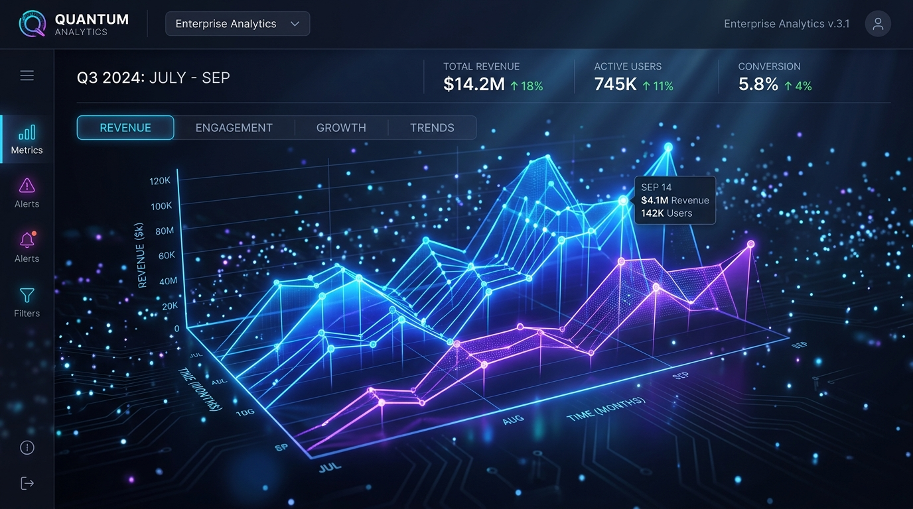
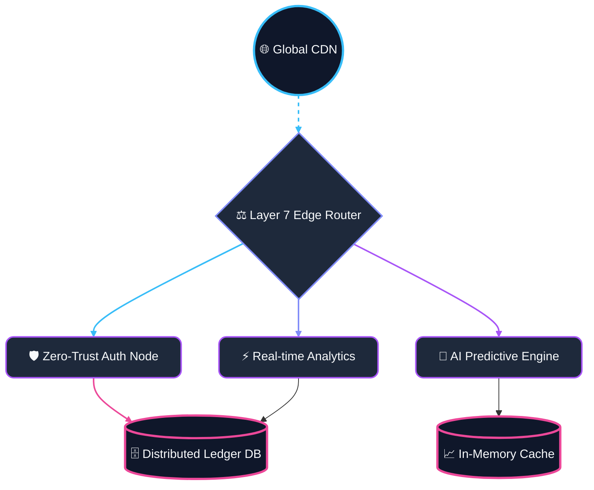

  

  # ⚡ BeatsVibe Enterprise ⚡
  
  **The Ultimate Enterprise Cloud and Cyber Security Orchestration Platform**
  
  
  
  
  

 

## 🌌 Platform Overview
BeatsVibe Enterprise is a massive scale, highly distributed polyglot microservice architecture designed to handle complex computing loads across hybrid-cloud environments. The system integrates advanced analytics, real-time threat intelligence, and zero-trust orchestration.

  

---

## 🏗️ 3D Orchestration Architecture Flow

 

## 🚀 Key Features

* **Polyglot Ecosystem**: Written and optimized across 50+ programming languages to leverage the strongest capabilities of every toolchain (from Assembly core routines to Python AI engines).
* **AI-Driven Infrastructure**: Auto-scaling nodes dynamically predict load and scale down pre-emptively based on quantum-resistant neural models.
* **Massive Concurrency**: Engineered to support millions of concurrent socket connections for the ultimate enterprise data-streaming platform.

---

  
Engineered for the Future.

  

