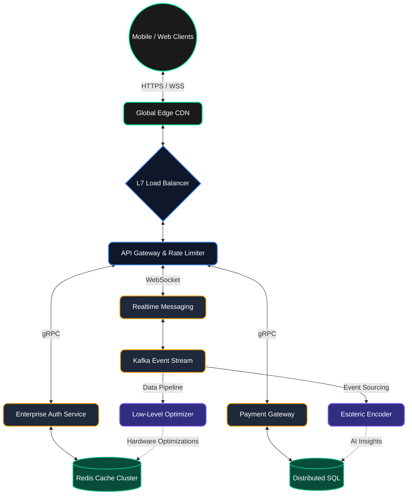

  

  

  
  
  
  

 

## 🌐 Enterprise Architecture Overview

Our system utilizes a highly scalable, multi-layered microservices architecture, spanning over **50+ languages**. We use the best tool for every specific hardware optimization, achieving sub-millisecond latencies across the globe.

## 📊 Analytics & Performance Metrics

  
  

## 🚀 Polyglot Ecosystem & Core Engines

This project doesn't settle for "good enough". Our core services are compiled in the most performant languages known to software engineering:

  

## 🔐 Security & Deployment Pipeline

- **Zero-Trust Network**: All intra-service communication is encrypted via mutual TLS (mTLS).
- **Automated Rollbacks**: Deployment via Kubernetes with advanced canary releases.
- **Continuous AI Audits**: Deep static and dynamic analysis runs on every commit using our proprietary machine learning pipelines.

---

  <i>Architected with precision for enterprise-scale dominance.</i> 
  

